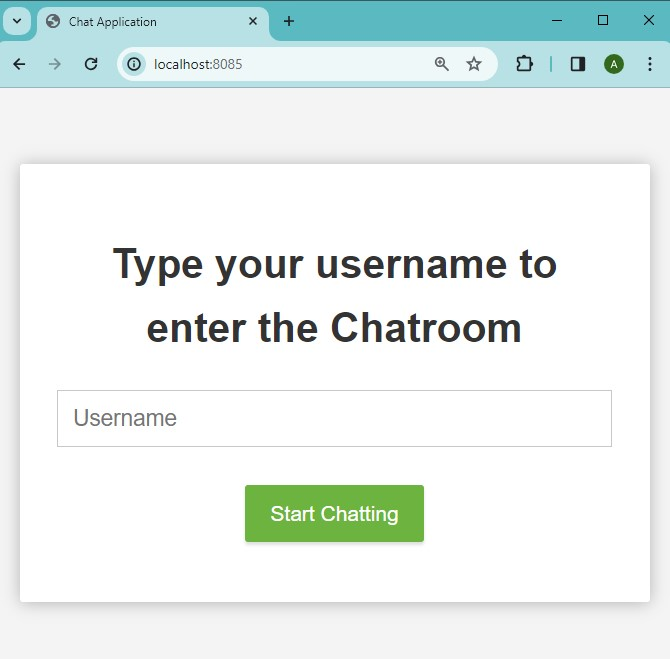
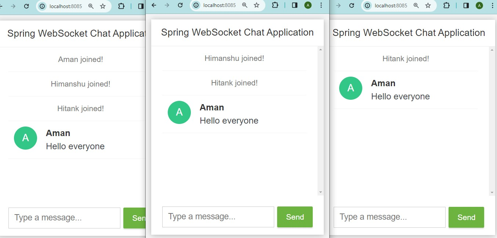
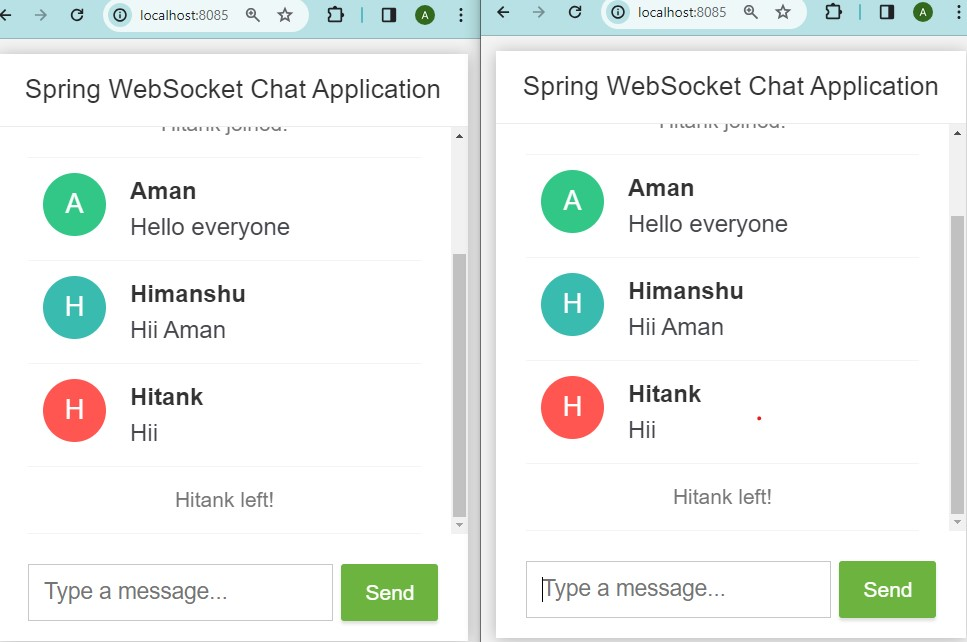

# Chat Application Project

This is a chat application project that allows users to communicate with each other in real-time. 
It is built using the Spring Boot framework for the backend, SockJS for WebSocket communication, and HTML, CSS and JavaScript for the frontend.
The project utilizes Maven as the build tool for the backend.

## Features
* Users are required to log in with a username before they can access the chat application.
* Once logged in, users are directed to the chat page where they can send messages in the chatroom.
*  Users are notified when new users join the chatroom, allowing them to be aware of other participants.
* Users can log out from the application, and their username will be removed from the user list displayed to other participants.

## Tech Stack
* **Spring-Boot** : A Java-based framework used for building the backend server and handling business logic.
  
* **SockJS** : A WebSocket emulation library that enables real-time communication between the server and clients.
  
* **JavaScript** : Used for client-side scripting and enhancing interactivity on the web.
  
* **HTML** : The markup language used to structure content on the web, defining elements like headings, paragraphs, and links.
  
* **CSS** : The style sheet language used to control the presentation of HTML elements, enhancing the visual layout and appearance of web pages.

## Prerequisites
- Java Development Kit (JDK) 17 or higher
- Maven
- IDE : IntelliJ (or) Eclipse

## Installation
1. **Clone the repository**: `git clone https://github.com/aman-gupti/Chat_Application.git`
   
2. **Navigate to the project directory**: `cd ChatApplication`

3. **Build the project**: `mvn clean install`

4. **Run the application**: `java -jar target/ChatApplication.jar`

5. **Open your web browser** and visit http://localhost:8085 to access the chat application.

## ScreenShot
-Login

- Chat Room

